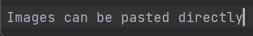

# Markdown Tutorial

# This is a heading

## This is a smaller heading

### Headings become smaller with more hashtags

This is normal text (no hashtags)
If you don't double page break, it will be on the same line.

**This is bolded text** (** around the text)

*This is slanted text* (* around the text)

>This is a block quote (> at the beginning of the text)

1. Ordered
2. For lists!

- Unordered List
- For bullet points

`//for small amounts of code`

```java
public class PointMain{
    public static void main(String[] args) {
        System.out.println("deez nuts lol");
    }
}
```

|Tables | More tables |
|-------|-------------|
|deez   | nuts        |

- [ ] This is a task list
- [ ] Remember the space
- [x] To check something, type x inside

For a horizontal line

---

For links:
[Youtube]{https://www.youtube.com/}

Images can be pasted directly


